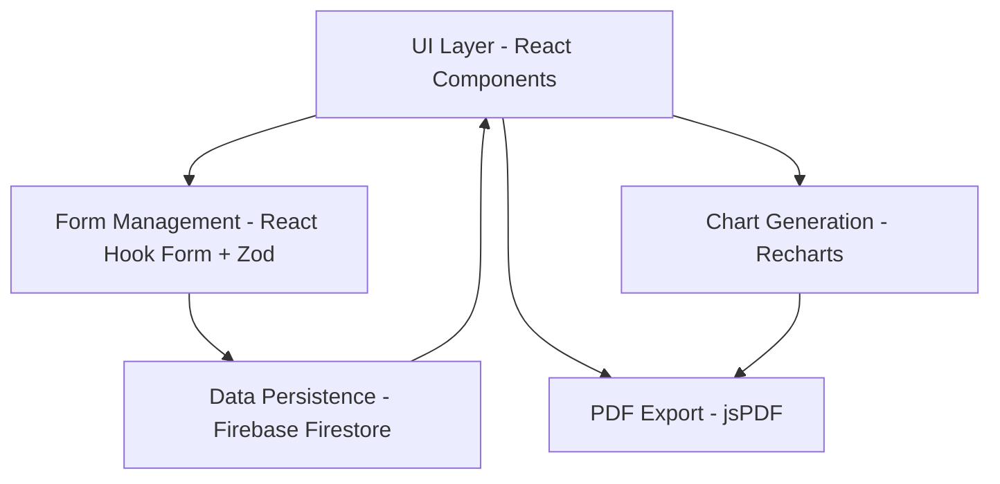

# Design Document: Sistema de Evaluación Auditiva Profesional

## Overview

El Sistema de Evaluación Auditiva Profesional es una aplicación web Next.js que transforma el sistema actual de gráficas médicas simples en una plataforma integral para realizar evaluaciones audiológicas completas. El sistema permite a profesionales de audiología de la Universidad del Valle realizar tres tipos de pruebas (Audiometría Tonal, Logoaudiometría y Timpanometría), capturar datos del paciente y examinador, generar gráficas profesionales específicas para cada tipo de prueba, consolidar resultados en informes exportables a PDF, y gestionar evaluaciones mediante persistencia en Firebase.

La arquitectura sigue un patrón de componentes React con separación clara entre lógica de negocio, presentación y persistencia. El sistema utiliza React Hook Form con Zod para validación de formularios, Recharts para generación de gráficas, jsPDF para exportación de documentos, y Firebase Firestore para almacenamiento de datos.

## Architecture

### High-Level Architecture



### Component Hierarchy

```
app/
├── page.tsx (Nueva Evaluación)
├── saved/page.tsx (Evaluaciones Guardadas)
└── layout.tsx

components/
├── test-selector.tsx (Selector de Pruebas)
├── patient-form.tsx (Formulario Paciente)
├── audiometry-form.tsx (Formulario Audiometría Tonal)
├── logoaudiometry-form.tsx (Formulario Logoaudiometría)
├── tympanometry-form.tsx (Formulario Timpanometría)
├── examiner-form.tsx (Formulario Examinador)
├── consolidated-report.tsx (Informe Consolidado)
├── audiometry-chart.tsx (Gráfica Audiometría)
├── logoaudiometry-chart.tsx (Gráfica Logoaudiometría)
├── tympanometry-chart.tsx (Gráfica Timpanometría)
└── evaluation-list.tsx (Lista de Evaluaciones)

lib/
├── validation-schemas.ts (Esquemas Zod)
├── chart-generators.ts (Lógica de Gráficas)
├── pdf-export.ts (Generación PDF)
└── firebase-service.ts (Operaciones Firebase)
```

## Components and Interfaces

### Core Type Definitions

```typescript
// types/evaluation.ts

type TipoPrueba = 'tonal' | 'logoaudiometria' | 'timpanometria';

type Sexo = 'masculino' | 'femenino' | 'otro';

type Oido = 'derecho' | 'izquierdo';

type TipoCurvaTimpanometrica = 'A' | 'B' | 'C' | 'As' | 'Ad';

interface Paciente {
  apellido: string;
  nombre: string;
  fechaNacimiento: Date;
  sexo: Sexo;
}

interface FrecuenciasAudiometry {
  '250': number;
  '500': number;
  '1000': number;
  '2000': number;
  '4000': number;
  '8000': number;
}

interface DatosAudiometriaTonal {
  tipo: 'tonal';
  oido_derecho: Partial<FrecuenciasAudiometry>;
  oido_izquierdo: Partial<FrecuenciasAudiometry>;
}

interface DatosLogoaudiometria {
  tipo: 'logoaudiometria';
  srt: {
    derecho: number;
    izquierdo: number;
  };
  sds: {
    derecho: number;
    izquierdo: number;
  };
}

interface DatosTimpanometria {
  tipo: 'timpanometria';
  derecho: {
    tipoCurva: TipoCurvaTimpanometrica;
    presionPico: number;
    cumplimiento: number;
  };
  izquierdo: {
    tipoCurva: TipoCurvaTimpanometrica;
    presionPico: number;
    cumplimiento: number;
  };
}

type DatosPrueba = DatosAudiometriaTonal | DatosLogoaudiometria | DatosTimpanometria;

interface Examinador {
  nombre: string;
  codigo: string;
}

interface EvaluacionAuditiva {
  id?: string;
  paciente: Paciente;
  pruebas: DatosPrueba[];
  examinador: Examinador;
  fechaExamen: Date;
}
```

### Component: TestSelector

**Purpose:** Permite al usuario seleccionar hasta 3 tipos de pruebas audiológicas mediante tarjetas visuales.

**Props:**
```typescript
interface TestSelectorProps {
  selectedTests: TipoPrueba[];
  onAddTest: (test: TipoPrueba) => void;
  onRemoveTest: (test: TipoPrueba) => void;
}
```

**Behavior:**
- Muestra 3 tarjetas (Audiometría Tonal, Logoaudiometría, Timpanometría)
- Deshabilita tarjetas ya seleccionadas
- Deshabilita botón "AÑADIR PRUEBA" cuando hay 3 pruebas seleccionadas
- Muestra lista de pruebas seleccionadas con botón de eliminar
- Cada prueba puede agregarse solo una vez

### Component: PatientForm

**Purpose:** Captura los datos demográficos del paciente.

**Props:**
```typescript
interface PatientFormProps {
  onSubmit: (data: Paciente) => void;
  initialData?: Paciente;
}
```

**Fields:**
- Apellido (text, required)
- Nombre (text, required)
- Fecha de Nacimiento (date picker DD/MM/AAAA, required)
- Sexo (select: Masculino/Femenino/Otro, required)

**Validation:**
- Todos los campos son requeridos
- Fecha debe ser válida y no futura
- Validación en tiempo real con React Hook Form + Zod

### Component: AudiometryForm

**Purpose:** Captura datos de audiometría tonal para ambos oídos.

**Props:**
```typescript
interface AudiometryFormProps {
  onSubmit: (data: DatosAudiometriaTonal) => void;
  initialData?: DatosAudiometriaTonal;
}
```

**Fields:**
- 6 frecuencias para OD: 250, 500, 1000, 2000, 4000, 8000 Hz (number input, dB)
- 6 frecuencias para OI: 250, 500, 1000, 2000, 4000, 8000 Hz (number input, dB)

**Validation:**
- Al menos 4 frecuencias completadas por oído
- Valores numéricos válidos
- Rango típico: -10 a 120 dB

### Component: LogoaudiometryForm

**Purpose:** Captura datos de logoaudiometría (SRT y SDS).

**Props:**
```typescript
interface LogoaudiometryFormProps {
  onSubmit: (data: DatosLogoaudiometria) => void;
  initialData?: DatosLogoaudiometria;
}
```

**Fields:**
- SRT OD (number input, dB, required)
- SRT OI (number input, dB, required)
- SDS OD (number input, %, required)
- SDS OI (number input, %, required)

**Validation:**
- Todos los campos requeridos
- SRT: valores numéricos válidos (típicamente 0-100 dB)
- SDS: valores entre 0-100%

### Component: TympanometryForm

**Purpose:** Captura datos de timpanometría para ambos oídos.

**Props:**
```typescript
interface TympanometryFormProps {
  onSubmit: (data: DatosTimpanometria) => void;
  initialData?: DatosTimpanometria;
}
```

**Fields:**
- OD: Tipo de curva (select: A/B/C/As/Ad), Presión pico (daPa), Cumplimiento (ml)
- OI: Tipo de curva (select: A/B/C/As/Ad), Presión pico (daPa), Cumplimiento (ml)

**Validation:**
- Todos los campos requeridos para ambos oídos
- Presión: valores numéricos (típicamente -400 a +200 daPa)
- Cumplimiento: valores numéricos positivos (típicamente 0-3 ml)

### Component: ExaminerForm

**Purpose:** Captura datos del examinador.

**Props:**
```typescript
interface ExaminerFormProps {
  onSubmit: (data: Examinador) => void;
  initialData?: Examinador;
}
```

**Fields:**
- Nombre (text, required)
- Código profesional (text, 6 dígitos, required)

**Validation:**
- Ambos campos requeridos
- Código debe ser exactamente 6 dígitos numéricos

### Component: AudiometryChart

**Purpose:** Genera gráfica de líneas para audiometría tonal.

**Props:**
```typescript
interface AudiometryChartProps {
  data: DatosAudiometriaTonal;
  width?: number;
  height?: number;
}
```

**Chart Specifications:**
- Type: Line chart (Recharts LineChart)
- X-axis: Frecuencias [250, 500, 1000, 2000, 4000, 8000] Hz
- Y-axis: Decibeles (dB), rango típico -10 a 120
- Series 1: OD (línea roja, círculos como marcadores)
- Series 2: OI (línea azul, cruces como marcadores)
- Legend: "Oído Derecho (OD)" y "Oído Izquierdo (OI)"
- Grid: Visible para facilitar lectura
- Responsive: Adapta tamaño según contenedor

### Component: LogoaudiometryChart

**Purpose:** Genera curva sigmoidea para logoaudiometría.

**Props:**
```typescript
interface LogoaudiometryChartProps {
  data: DatosLogoaudiometria;
  width?: number;
  height?: number;
}
```

**Chart Specifications:**
- Type: Line chart con curva sigmoidea interpolada
- X-axis: Intensidad (dB), rango 0-100
- Y-axis: Reconocimiento (%), rango 0-100
- Curva generada: Interpolación sigmoidea basada en SRT y SDS
- Series 1: OD (línea roja)
- Series 2: OI (línea azul)
- Markers: Puntos en SRT y SDS
- Legend: "Oído Derecho (OD)" y "Oído Izquierdo (OI)"

**Sigmoid Interpolation Logic:**
```typescript
// Genera curva sigmoidea desde SRT (umbral) hasta SDS (máximo)
function generateSigmoidCurve(srt: number, sds: number): Point[] {
  const points: Point[] = [];
  for (let db = 0; db <= 100; db += 5) {
    const x = (db - srt) / 10; // Normalizar alrededor del SRT
    const y = sds / (1 + Math.exp(-x)); // Función sigmoidea
    points.push({ db, percentage: y });
  }
  return points;
}
```

### Component: TympanometryChart

**Purpose:** Genera timpanograma basado en tipo de curva.

**Props:**
```typescript
interface TympanometryChartProps {
  data: DatosTimpanometria;
  width?: number;
  height?: number;
}
```

**Chart Specifications:**
- Type: Area chart (Recharts AreaChart)
- X-axis: Presión (daPa), rango -400 a +200
- Y-axis: Cumplimiento (ml), rango 0 a 3
- Curva generada según tipo (A/B/C/As/Ad)
- Series 1: OD (área roja semi-transparente)
- Series 2: OI (área azul semi-transparente)
- Peak marker: Punto en presión pico con cumplimiento máximo
- Legend: "Oído Derecho (OD)" y "Oído Izquierdo (OI)"

**Curve Generation Logic:**
```typescript
function generateTympanogramCurve(
  tipo: TipoCurvaTimpanometrica,
  presionPico: number,
  cumplimiento: number
): Point[] {
  const points: Point[] = [];
  
  switch (tipo) {
    case 'A': // Curva normal, pico en presión cercana a 0
      for (let p = -400; p <= 200; p += 10) {
        const y = cumplimiento * Math.exp(-Math.pow((p - presionPico) / 100, 2));
        points.push({ presion: p, cumplimiento: y });
      }
      break;
    case 'B': // Curva plana, sin pico
      for (let p = -400; p <= 200; p += 10) {
        points.push({ presion: p, cumplimiento: cumplimiento * 0.2 });
      }
      break;
    case 'C': // Pico desplazado a presiones negativas
      for (let p = -400; p <= 200; p += 10) {
        const y = cumplimiento * Math.exp(-Math.pow((p - presionPico) / 100, 2));
        points.push({ presion: p, cumplimiento: y });
      }
      break;
    case 'As': // Pico estrecho (rigidez)
      for (let p = -400; p <= 200; p += 10) {
        const y = cumplimiento * Math.exp(-Math.pow((p - presionPico) / 50, 2));
        points.push({ presion: p, cumplimiento: y });
      }
      break;
    case 'Ad': // Pico ancho (hipercompliance)
      for (let p = -400; p <= 200; p += 10) {
        const y = cumplimiento * Math.exp(-Math.pow((p - presionPico) / 150, 2));
        points.push({ presion: p, cumplimiento: y });
      }
      break;
  }
  
  return points;
}
```

### Component: ConsolidatedReport

**Purpose:** Muestra el informe consolidado con todos los datos y gráficas.

**Props:**
```typescript
interface ConsolidatedReportProps {
  evaluation: EvaluacionAuditiva;
  onExportPDF: () => void;
}
```

**Layout Structure:**
```
┌─────────────────────────────────────────────────┐
│ SISTEMA EVALUACIÓN AUDITIVA                     │
│ Universidad del Valle                           │
├─────────────────────────────────────────────────┤
│ PACIENTE: [Apellido] [Nombre]                   │
│ Fecha Nacimiento: [DD/MM/AAAA] - Sexo: [Sexo]  │
│ FECHA EXAMEN: [DD/MM/AAAA HH:MM]               │
├─────────────────────────────────────────────────┤
│ 📊 PRUEBAS REALIZADAS:                          │
│                                                 │
│ 1. Audiometría Tonal:                           │
│    - OD: 250Hz=XXdB, 500Hz=XXdB, ...           │
│    - OI: 250Hz=XXdB, 500Hz=XXdB, ...           │
│    [Gráfica AudiometryChart]                    │
│                                                 │
│ 2. Logoaudiometría:                             │
│    - SRT: OD=XXdB, OI=XXdB                     │
│    - SDS: OD=XX%, OI=XX%                       │
│    [Gráfica LogoaudiometryChart]                │
│                                                 │
│ 3. Timpanometría:                               │
│    - OD: Tipo X, XXdaPa, X.Xml                 │
│    - OI: Tipo X, XXdaPa, X.Xml                 │
│    [Gráfica TympanometryChart]                  │
├─────────────────────────────────────────────────┤
│ EXAMINADOR: [Nombre] - Código [XXXXXX]         │
├─────────────────────────────────────────────────┤
│ [Botón: Exportar a PDF]                         │
└─────────────────────────────────────────────────┘
```

**Behavior:**
- Se muestra en modal o página completa al presionar "GENERAR INFORME COMPLETO"
- Renderiza solo las pruebas que fueron seleccionadas
- Cada prueba muestra sus datos numéricos seguidos de su gráfica
- Botón de exportar a PDF visible y accesible

### Component: EvaluationList

**Purpose:** Lista todas las evaluaciones guardadas con opciones de gestión.

**Props:**
```typescript
interface EvaluationListProps {
  evaluations: EvaluacionAuditiva[];
  onView: (id: string) => void;
  onEdit: (id: string) => void;
  onDelete: (id: string) => void;
  searchQuery: string;
  onSearchChange: (query: string) => void;
}
```

**Features:**
- Campo de búsqueda en tiempo real
- Filtrado por apellido o nombre del paciente
- Búsqueda case-insensitive
- Cada item muestra: Apellido, Nombre, Fecha examen, Tipos de pruebas
- Botones: Ver, Editar, Eliminar
- Confirmación antes de eliminar
- Mensaje cuando no hay resultados

## Data Models

### Validation Schemas (Zod)

```typescript
// lib/validation-schemas.ts

import { z } from 'zod';

export const pacienteSchema = z.object({
  apellido: z.string().min(1, 'Apellido es requerido'),
  nombre: z.string().min(1, 'Nombre es requerido'),
  fechaNacimiento: z.date({
    required_error: 'Fecha de nacimiento es requerida',
  }).refine(date => date <= new Date(), {
    message: 'La fecha no puede ser futura',
  }),
  sexo: z.enum(['masculino', 'femenino', 'otro'], {
    required_error: 'Sexo es requerido',
  }),
});

export const frecuenciasSchema = z.object({
  '250': z.number().optional(),
  '500': z.number().optional(),
  '1000': z.number().optional(),
  '2000': z.number().optional(),
  '4000': z.number().optional(),
  '8000': z.number().optional(),
}).refine(
  (data) => {
    const completedCount = Object.values(data).filter(v => v !== undefined).length;
    return completedCount >= 4;
  },
  { message: 'Se requieren al menos 4 frecuencias completadas' }
);

export const audiometriaTonalSchema = z.object({
  tipo: z.literal('tonal'),
  oido_derecho: frecuenciasSchema,
  oido_izquierdo: frecuenciasSchema,
});

export const logoaudiometriaSchema = z.object({
  tipo: z.literal('logoaudiometria'),
  srt: z.object({
    derecho: z.number({ required_error: 'SRT OD es requerido' }),
    izquierdo: z.number({ required_error: 'SRT OI es requerido' }),
  }),
  sds: z.object({
    derecho: z.number({ required_error: 'SDS OD es requerido' })
      .min(0, 'SDS debe ser entre 0 y 100')
      .max(100, 'SDS debe ser entre 0 y 100'),
    izquierdo: z.number({ required_error: 'SDS OI es requerido' })
      .min(0, 'SDS debe ser entre 0 y 100')
      .max(100, 'SDS debe ser entre 0 y 100'),
  }),
});

export const timpanometriaSchema = z.object({
  tipo: z.literal('timpanometria'),
  derecho: z.object({
    tipoCurva: z.enum(['A', 'B', 'C', 'As', 'Ad'], {
      required_error: 'Tipo de curva OD es requerido',
    }),
    presionPico: z.number({ required_error: 'Presión pico OD es requerida' }),
    cumplimiento: z.number({ required_error: 'Cumplimiento OD es requerido' })
      .positive('Cumplimiento debe ser positivo'),
  }),
  izquierdo: z.object({
    tipoCurva: z.enum(['A', 'B', 'C', 'As', 'Ad'], {
      required_error: 'Tipo de curva OI es requerido',
    }),
    presionPico: z.number({ required_error: 'Presión pico OI es requerida' }),
    cumplimiento: z.number({ required_error: 'Cumplimiento OI es requerido' })
      .positive('Cumplimiento debe ser positivo'),
  }),
});

export const examinadorSchema = z.object({
  nombre: z.string().min(1, 'Nombre del examinador es requerido'),
  codigo: z.string()
    .length(6, 'El código debe tener exactamente 6 dígitos')
    .regex(/^\d{6}$/, 'El código debe contener solo dígitos'),
});

export const evaluacionAuditivaSchema = z.object({
  id: z.string().optional(),
  paciente: pacienteSchema,
  pruebas: z.array(
    z.discriminatedUnion('tipo', [
      audiometriaTonalSchema,
      logoaudiometriaSchema,
      timpanometriaSchema,
    ])
  ).min(1, 'Se requiere al menos una prueba')
   .max(3, 'Máximo 3 pruebas permitidas'),
  examinador: examinadorSchema,
  fechaExamen: z.date(),
});
```

### Firebase Data Structure

```typescript
// Firestore collection: "evaluaciones"
// Document structure:
{
  id: string,
  paciente: {
    apellido: string,
    nombre: string,
    fechaNacimiento: Timestamp,
    sexo: string
  },
  pruebas: [
    {
      tipo: 'tonal' | 'logoaudiometria' | 'timpanometria',
      // ... datos específicos de cada prueba
    }
  ],
  examinador: {
    nombre: string,
    codigo: string
  },
  fechaExamen: Timestamp,
  createdAt: Timestamp,
  updatedAt: Timestamp
}
```

### Firebase Service Interface

```typescript
// lib/firebase-service.ts

export interface FirebaseService {
  // Guardar nueva evaluación
  saveEvaluation(evaluation: EvaluacionAuditiva): Promise<string>;
  
  // Actualizar evaluación existente
  updateEvaluation(id: string, evaluation: EvaluacionAuditiva): Promise<void>;
  
  // Obtener evaluación por ID
  getEvaluation(id: string): Promise<EvaluacionAuditiva | null>;
  
  // Obtener todas las evaluaciones
  getAllEvaluations(): Promise<EvaluacionAuditiva[]>;
  
  // Eliminar evaluación
  deleteEvaluation(id: string): Promise<void>;
  
  // Buscar evaluaciones por nombre o apellido
  searchEvaluations(query: string): Promise<EvaluacionAuditiva[]>;
}

// Implementación
export class FirestoreService implements FirebaseService {
  private collection = 'evaluaciones';
  
  async saveEvaluation(evaluation: EvaluacionAuditiva): Promise<string> {
    const docRef = await addDoc(collection(db, this.collection), {
      ...evaluation,
      paciente: {
        ...evaluation.paciente,
        fechaNacimiento: Timestamp.fromDate(evaluation.paciente.fechaNacimiento),
      },
      fechaExamen: Timestamp.fromDate(evaluation.fechaExamen),
      createdAt: serverTimestamp(),
      updatedAt: serverTimestamp(),
    });
    return docRef.id;
  }
  
  async updateEvaluation(id: string, evaluation: EvaluacionAuditiva): Promise<void> {
    const docRef = doc(db, this.collection, id);
    await updateDoc(docRef, {
      ...evaluation,
      paciente: {
        ...evaluation.paciente,
        fechaNacimiento: Timestamp.fromDate(evaluation.paciente.fechaNacimiento),
      },
      fechaExamen: Timestamp.fromDate(evaluation.fechaExamen),
      updatedAt: serverTimestamp(),
    });
  }
  
  async getEvaluation(id: string): Promise<EvaluacionAuditiva | null> {
    const docRef = doc(db, this.collection, id);
    const docSnap = await getDoc(docRef);
    
    if (!docSnap.exists()) return null;
    
    const data = docSnap.data();
    return {
      id: docSnap.id,
      ...data,
      paciente: {
        ...data.paciente,
        fechaNacimiento: data.paciente.fechaNacimiento.toDate(),
      },
      fechaExamen: data.fechaExamen.toDate(),
    } as EvaluacionAuditiva;
  }
  
  async getAllEvaluations(): Promise<EvaluacionAuditiva[]> {
    const querySnapshot = await getDocs(
      query(collection(db, this.collection), orderBy('fechaExamen', 'desc'))
    );
    
    return querySnapshot.docs.map(doc => ({
      id: doc.id,
      ...doc.data(),
      paciente: {
        ...doc.data().paciente,
        fechaNacimiento: doc.data().paciente.fechaNacimiento.toDate(),
      },
      fechaExamen: doc.data().fechaExamen.toDate(),
    })) as EvaluacionAuditiva[];
  }
  
  async deleteEvaluation(id: string): Promise<void> {
    const docRef = doc(db, this.collection, id);
    await deleteDoc(docRef);
  }
  
  async searchEvaluations(query: string): Promise<EvaluacionAuditiva[]> {
    const allEvaluations = await this.getAllEvaluations();
    const lowerQuery = query.toLowerCase();
    
    return allEvaluations.filter(evaluation => 
      evaluation.paciente.apellido.toLowerCase().includes(lowerQuery) ||
      evaluation.paciente.nombre.toLowerCase().includes(lowerQuery)
    );
  }
}
```

### PDF Export Service

```typescript
// lib/pdf-export.ts

import jsPDF from 'jspdf';
import html2canvas from 'html2canvas';

export interface PDFExportService {
  exportEvaluationToPDF(
    evaluation: EvaluacionAuditiva,
    reportElement: HTMLElement
  ): Promise<void>;
}

export class JsPDFExportService implements PDFExportService {
  async exportEvaluationToPDF(
    evaluation: EvaluacionAuditiva,
    reportElement: HTMLElement
  ): Promise<void> {
    // Crear PDF en formato A4 landscape
    const pdf = new jsPDF({
      orientation: 'landscape',
      unit: 'mm',
      format: 'a4',
    });
    
    // Agregar encabezado institucional
    pdf.setFontSize(16);
    pdf.text('Sistema Evaluación Auditiva - Universidad del Valle', 148, 15, {
      align: 'center',
    });
    
    // Convertir el elemento HTML a canvas
    const canvas = await html2canvas(reportElement, {
      scale: 2,
      logging: false,
      useCORS: true,
    });
    
    const imgData = canvas.toDataURL('image/png');
    const imgWidth = 277; // A4 landscape width in mm minus margins
    const imgHeight = (canvas.height * imgWidth) / canvas.width;
    
    // Agregar imagen al PDF
    pdf.addImage(imgData, 'PNG', 10, 25, imgWidth, imgHeight);
    
    // Generar nombre de archivo
    const fileName = `Evaluacion_${evaluation.paciente.apellido}_${evaluation.paciente.nombre}_${
      evaluation.fechaExamen.toISOString().split('T')[0]
    }.pdf`;
    
    // Descargar PDF
    pdf.save(fileName);
  }
}
```

## Correctness Properties

*A property is a characteristic or behavior that should hold true across all valid executions of a system—essentially, a formal statement about what the system should do. Properties serve as the bridge between human-readable specifications and machine-verifiable correctness guarantees.*

### Property 1: Test Addition Grows List

*For any* list of selected tests and any valid test type not already in the list, adding the test should result in the list length increasing by one and the test appearing in the list.

**Validates: Requirements 1.2**

### Property 2: Duplicate Test Prevention

*For any* test type, attempting to add it when it's already in the selected tests list should result in the list remaining unchanged.

**Validates: Requirements 1.3**

### Property 3: Test Removal Reduces List

*For any* non-empty list of selected tests and any test in that list, removing the test should result in the list length decreasing by one and the test no longer appearing in the list.

**Validates: Requirements 1.5**

### Property 4: Selected Tests Display Completeness

*For any* set of selected tests, the rendered list should contain exactly those tests and no others.

**Validates: Requirements 1.6**

### Property 5: Patient Required Fields Validation

*For any* patient data object, if any of the fields (apellido, nombre, fechaNacimiento, sexo) is missing or empty, validation should fail and prevent report generation.

**Validates: Requirements 2.2, 2.3, 2.4, 2.5**

### Property 6: Audiometry Conditional Rendering

*For any* evaluation state, when Audiometría Tonal is in the selected tests list, the form should render frequency input fields for both ears; when it's not selected, those fields should not be rendered.

**Validates: Requirements 3.1, 3.2**

### Property 7: Audiometry Minimum Frequencies Validation

*For any* audiometry data, if either ear has fewer than 4 frequencies with valid values, validation should fail.

**Validates: Requirements 3.3, 3.4**

### Property 8: Audiometry Numeric Validation

*For any* audiometry frequency input, the system should accept valid numeric values and reject non-numeric or invalid inputs.

**Validates: Requirements 3.5, 3.6**

### Property 9: Logoaudiometry Conditional Rendering

*For any* evaluation state, when Logoaudiometría is in the selected tests list, the form should render SRT and SDS fields for both ears; when it's not selected, those fields should not be rendered.

**Validates: Requirements 4.1, 4.2**

### Property 10: Logoaudiometry Required Fields Validation

*For any* logoaudiometry data, if any of the four required fields (SRT OD, SRT OI, SDS OD, SDS OI) is missing, validation should fail.

**Validates: Requirements 4.3, 4.4, 4.5, 4.6**

### Property 11: Logoaudiometry SDS Range Validation

*For any* SDS value, the system should accept values between 0 and 100 inclusive, and reject values outside this range.

**Validates: Requirements 4.8**

### Property 12: Tympanometry Conditional Rendering

*For any* evaluation state, when Timpanometría is in the selected tests list, the form should render curve type, pressure, and compliance fields for both ears; when it's not selected, those fields should not be rendered.

**Validates: Requirements 5.1, 5.2**

### Property 13: Tympanometry Required Fields Validation

*For any* tympanometry data, if any of the six required fields (tipo, presión, cumplimiento for each ear) is missing, validation should fail.

**Validates: Requirements 5.4, 5.5, 5.6, 5.7, 5.8, 5.9**

### Property 14: Tympanometry Numeric Validation

*For any* tympanometry pressure or compliance input, the system should accept valid numeric values and reject non-numeric inputs.

**Validates: Requirements 5.10, 5.11**

### Property 15: Examiner Required Fields Validation

*For any* examiner data, if either nombre or codigo is missing or empty, validation should fail.

**Validates: Requirements 6.3, 6.4**

### Property 16: Examiner Code Format Validation

*For any* examiner code, the system should accept exactly 6-digit numeric strings and reject any string that doesn't match this format.

**Validates: Requirements 6.5, 6.6**

### Property 17: Minimum Tests Validation

*For any* evaluation, if the selected tests list is empty, validation should fail and prevent report generation.

**Validates: Requirements 7.1**

### Property 18: Complete Data Enables Report Generation

*For any* evaluation with valid patient data, at least one valid test, and valid examiner data, the "GENERAR INFORME COMPLETO" button should be enabled.

**Validates: Requirements 7.3**

### Property 19: Audiometry Chart Structure

*For any* valid audiometry data, the generated chart should have an X-axis labeled with frequencies [250, 500, 1000, 2000, 4000, 8000] Hz and a Y-axis labeled with dB.

**Validates: Requirements 8.1, 8.2**

### Property 20: Audiometry Chart Color Coding

*For any* audiometry chart, the OD data series should be rendered in red and the OI data series should be rendered in blue.

**Validates: Requirements 8.3, 8.4**

### Property 21: Audiometry Chart Completeness

*For any* audiometry chart, it should include a legend identifying OD and OI, and axis labels with units.

**Validates: Requirements 8.5, 8.6, 8.7**

### Property 22: Logoaudiometry Chart Structure

*For any* valid logoaudiometry data, the generated chart should have an X-axis for dB (0-100) and a Y-axis for percentage (0-100).

**Validates: Requirements 9.1, 9.2**

### Property 23: Logoaudiometry Chart Data Representation

*For any* logoaudiometry data, the chart should display sigmoid curves for both ears with differentiated visual representation.

**Validates: Requirements 9.3, 9.4, 9.5, 9.6, 9.7**

### Property 24: Tympanometry Chart Structure

*For any* valid tympanometry data, the generated chart should have an X-axis for pressure (daPa) and a Y-axis for compliance (ml).

**Validates: Requirements 10.1, 10.2**

### Property 25: Tympanometry Chart Curve Generation

*For any* tympanometry data, the chart should generate appropriate curve shapes based on the curve type (A/B/C/As/Ad) with peak markers at the specified pressure.

**Validates: Requirements 10.3, 10.4, 10.5, 10.6, 10.7, 10.8**

### Property 26: Report Patient Data Completeness

*For any* generated report, the header should contain all patient data fields: apellido, nombre, fechaNacimiento, and sexo.

**Validates: Requirements 11.2**

### Property 27: Report Exam Date Inclusion

*For any* generated report, the header should contain the exact date and time of the exam.

**Validates: Requirements 11.3**

### Property 28: Report Tests Listing

*For any* generated report, all selected tests should appear in the report in order.

**Validates: Requirements 11.4**

### Property 29: Report Test Data Completeness

*For any* test in the report, the report should display all captured data values followed by the corresponding chart.

**Validates: Requirements 11.5, 11.6, 11.7**

### Property 30: Report Examiner Data Inclusion

*For any* generated report, the footer should contain the examiner's name and professional code.

**Validates: Requirements 11.8**

### Property 31: PDF Generation Completeness

*For any* generated PDF, it should contain all content from the consolidated report including all charts.

**Validates: Requirements 12.2, 12.3**

### Property 32: PDF Format Specification

*For any* generated PDF, it should be in A4 landscape format with the institutional header "Sistema Evaluación Auditiva - Universidad del Valle".

**Validates: Requirements 12.4, 12.5**

### Property 33: PDF Logo Inclusion

*For any* generated PDF, the institutional logo should be present in the header.

**Validates: Requirements 12.6**

### Property 34: PDF Chart Quality

*For any* chart in the generated PDF, it should maintain sufficient resolution and legibility.

**Validates: Requirements 12.7**

### Property 35: PDF Filename Format

*For any* generated PDF, the filename should follow the pattern "Evaluacion_[Apellido]_[Nombre]_[Fecha].pdf".

**Validates: Requirements 12.8**

### Property 36: Firebase Save Round Trip

*For any* valid evaluation, saving it to Firebase and then retrieving it should return an evaluation with equivalent data (dates may differ in precision but should represent the same moment).

**Validates: Requirements 13.1, 13.2, 13.3, 13.4, 13.5**

### Property 37: Firebase Unique ID Assignment

*For any* two evaluations saved to Firebase, they should receive different unique IDs.

**Validates: Requirements 13.6**

### Property 38: Saved Evaluations Retrieval

*For any* set of evaluations saved in Firebase, retrieving all evaluations should return a list containing all saved evaluations.

**Validates: Requirements 14.2**

### Property 39: Evaluation List Item Completeness

*For any* evaluation in the saved evaluations list, the list item should display apellido, nombre, fecha del examen, and tipos de pruebas.

**Validates: Requirements 14.3**

### Property 40: Evaluation Edit Data Loading

*For any* saved evaluation, clicking edit should load all the evaluation's data into the form fields.

**Validates: Requirements 14.8**

### Property 41: Evaluation Deletion Removes Data

*For any* saved evaluation, after confirming deletion, the evaluation should no longer exist in Firebase and should not appear in the list.

**Validates: Requirements 14.10**

### Property 42: Search Filters Results

*For any* search query and list of evaluations, the filtered results should only include evaluations where the query appears in either apellido or nombre.

**Validates: Requirements 15.2, 15.3, 15.4, 15.5**

### Property 43: Search Case Insensitivity

*For any* search query, the search should return the same results regardless of whether the query uses uppercase or lowercase letters.

**Validates: Requirements 15.7**

### Property 44: Real-time Validation Error Clearing

*For any* form field with an error, entering a valid value should immediately clear the error message for that field.

**Validates: Requirements 17.1**

### Property 45: Required Field Validation Triggering

*For any* required field, leaving it empty and moving focus away should trigger an error message.

**Validates: Requirements 17.2**

### Property 46: Invalid Input Validation

*For any* field with format requirements (numeric, date, code format), entering an invalid value should trigger an appropriate error message.

**Validates: Requirements 17.3, 17.4**

### Property 47: Visual Error Indicators

*For any* field with a validation error, the UI should display visual indicators (red border, error icon, or error message).

**Validates: Requirements 17.5, 17.6, 17.7**

## Error Handling

### Form Validation Errors

**Strategy:** Use React Hook Form with Zod schemas for comprehensive validation.

**Error Display:**
- Inline error messages below each field
- Red border on invalid fields
- Error summary at form level for multiple errors
- Real-time validation on blur and on submit

**Error Messages:**
```typescript
const errorMessages = {
  required: (field: string) => `${field} es requerido`,
  minLength: (field: string, min: number) => `${field} debe tener al menos ${min} caracteres`,
  invalidFormat: (field: string, format: string) => `${field} debe tener el formato ${format}`,
  outOfRange: (field: string, min: number, max: number) => 
    `${field} debe estar entre ${min} y ${max}`,
  minItems: (min: number) => `Se requieren al menos ${min} elementos`,
  maxItems: (max: number) => `Máximo ${max} elementos permitidos`,
};
```

### Firebase Operation Errors

**Save Errors:**
```typescript
try {
  await firebaseService.saveEvaluation(evaluation);
  toast.success('Evaluación guardada exitosamente');
} catch (error) {
  console.error('Error saving evaluation:', error);
  toast.error('Error al guardar la evaluación. Por favor intente nuevamente.');
}
```

**Load Errors:**
```typescript
try {
  const evaluations = await firebaseService.getAllEvaluations();
  setEvaluations(evaluations);
} catch (error) {
  console.error('Error loading evaluations:', error);
  toast.error('Error al cargar las evaluaciones. Por favor recargue la página.');
}
```

**Delete Errors:**
```typescript
try {
  await firebaseService.deleteEvaluation(id);
  toast.success('Evaluación eliminada exitosamente');
} catch (error) {
  console.error('Error deleting evaluation:', error);
  toast.error('Error al eliminar la evaluación. Por favor intente nuevamente.');
}
```

### PDF Export Errors

```typescript
try {
  await pdfService.exportEvaluationToPDF(evaluation, reportElement);
  toast.success('PDF generado exitosamente');
} catch (error) {
  console.error('Error generating PDF:', error);
  toast.error('Error al generar el PDF. Por favor intente nuevamente.');
}
```

### Chart Rendering Errors

```typescript
// Graceful degradation for missing data
function AudiometryChart({ data }: AudiometryChartProps) {
  const hasValidData = useMemo(() => {
    const odCount = Object.values(data.oido_derecho).filter(v => v !== undefined).length;
    const oiCount = Object.values(data.oido_izquierdo).filter(v => v !== undefined).length;
    return odCount >= 4 && oiCount >= 4;
  }, [data]);
  
  if (!hasValidData) {
    return (
      <div className="flex items-center justify-center h-64 bg-gray-100 rounded">
        <p className="text-gray-500">Datos insuficientes para generar la gráfica</p>
      </div>
    );
  }
  
  return <LineChart {...chartProps} />;
}
```

### Network Errors

```typescript
// Retry logic for Firebase operations
async function withRetry<T>(
  operation: () => Promise<T>,
  maxRetries: number = 3
): Promise<T> {
  let lastError: Error;
  
  for (let i = 0; i < maxRetries; i++) {
    try {
      return await operation();
    } catch (error) {
      lastError = error as Error;
      if (i < maxRetries - 1) {
        await new Promise(resolve => setTimeout(resolve, 1000 * (i + 1)));
      }
    }
  }
  
  throw lastError!;
}
```

## Testing Strategy

### Dual Testing Approach

The system will employ both unit testing and property-based testing to ensure comprehensive coverage:

- **Unit tests**: Verify specific examples, edge cases, and error conditions
- **Property tests**: Verify universal properties across all inputs

Both approaches are complementary and necessary. Unit tests catch concrete bugs in specific scenarios, while property tests verify general correctness across a wide range of inputs.

### Unit Testing

**Framework:** Vitest + React Testing Library

**Focus Areas:**
- Component rendering with specific props
- User interactions (clicks, form submissions)
- Edge cases (empty lists, maximum limits)
- Error conditions (network failures, validation errors)
- Integration between components

**Example Unit Tests:**
```typescript
describe('TestSelector', () => {
  it('should disable add button when 3 tests are selected', () => {
    const { getByText } = render(
      <TestSelector 
        selectedTests={['tonal', 'logoaudiometria', 'timpanometria']}
        onAddTest={jest.fn()}
        onRemoveTest={jest.fn()}
      />
    );
    expect(getByText('AÑADIR PRUEBA')).toBeDisabled();
  });
  
  it('should show confirmation dialog before deleting evaluation', async () => {
    const onDelete = jest.fn();
    const { getByText } = render(
      <EvaluationList 
        evaluations={mockEvaluations}
        onDelete={onDelete}
        {...otherProps}
      />
    );
    
    fireEvent.click(getByText('Eliminar'));
    expect(getByText('¿Está seguro?')).toBeInTheDocument();
  });
});
```

### Property-Based Testing

**Framework:** fast-check (JavaScript property-based testing library)

**Configuration:**
- Minimum 100 iterations per property test
- Each test tagged with feature name and property number
- Tag format: `Feature: sistema-evaluacion-auditiva, Property {number}: {property_text}`

**Property Test Examples:**

```typescript
import fc from 'fast-check';

// Feature: sistema-evaluacion-auditiva, Property 1: Test Addition Grows List
describe('Property 1: Test Addition Grows List', () => {
  it('should increase list length by one when adding a new test', () => {
    fc.assert(
      fc.property(
        fc.array(fc.constantFrom('tonal', 'logoaudiometria', 'timpanometria'), { maxLength: 2 }),
        fc.constantFrom('tonal', 'logoaudiometria', 'timpanometria'),
        (existingTests, newTest) => {
          fc.pre(!existingTests.includes(newTest)); // Precondition: test not already in list
          
          const initialLength = existingTests.length;
          const result = [...existingTests, newTest];
          
          expect(result.length).toBe(initialLength + 1);
          expect(result).toContain(newTest);
        }
      ),
      { numRuns: 100 }
    );
  });
});

// Feature: sistema-evaluacion-auditiva, Property 5: Patient Required Fields Validation
describe('Property 5: Patient Required Fields Validation', () => {
  it('should fail validation when any required field is missing', () => {
    fc.assert(
      fc.property(
        fc.record({
          apellido: fc.option(fc.string(), { nil: undefined }),
          nombre: fc.option(fc.string(), { nil: undefined }),
          fechaNacimiento: fc.option(fc.date(), { nil: undefined }),
          sexo: fc.option(fc.constantFrom('masculino', 'femenino', 'otro'), { nil: undefined }),
        }),
        (patientData) => {
          const hasAllFields = 
            patientData.apellido && 
            patientData.nombre && 
            patientData.fechaNacimiento && 
            patientData.sexo;
          
          const validationResult = pacienteSchema.safeParse(patientData);
          
          if (hasAllFields) {
            expect(validationResult.success).toBe(true);
          } else {
            expect(validationResult.success).toBe(false);
          }
        }
      ),
      { numRuns: 100 }
    );
  });
});

// Feature: sistema-evaluacion-auditiva, Property 16: Examiner Code Format Validation
describe('Property 16: Examiner Code Format Validation', () => {
  it('should accept only 6-digit numeric strings', () => {
    fc.assert(
      fc.property(
        fc.string(),
        (code) => {
          const is6Digits = /^\d{6}$/.test(code);
          const validationResult = examinadorSchema.shape.codigo.safeParse(code);
          
          expect(validationResult.success).toBe(is6Digits);
        }
      ),
      { numRuns: 100 }
    );
  });
});

// Feature: sistema-evaluacion-auditiva, Property 36: Firebase Save Round Trip
describe('Property 36: Firebase Save Round Trip', () => {
  it('should retrieve equivalent data after saving', async () => {
    fc.assert(
      fc.asyncProperty(
        generateValidEvaluation(), // Custom arbitrary generator
        async (evaluation) => {
          const id = await firebaseService.saveEvaluation(evaluation);
          const retrieved = await firebaseService.getEvaluation(id);
          
          expect(retrieved).not.toBeNull();
          expect(retrieved!.paciente).toEqual(evaluation.paciente);
          expect(retrieved!.pruebas).toEqual(evaluation.pruebas);
          expect(retrieved!.examinador).toEqual(evaluation.examinador);
          
          // Clean up
          await firebaseService.deleteEvaluation(id);
        }
      ),
      { numRuns: 100 }
    );
  });
});

// Feature: sistema-evaluacion-auditiva, Property 43: Search Case Insensitivity
describe('Property 43: Search Case Insensitivity', () => {
  it('should return same results regardless of query case', () => {
    fc.assert(
      fc.property(
        fc.array(generateValidEvaluation(), { minLength: 1, maxLength: 10 }),
        fc.string({ minLength: 1 }),
        (evaluations, query) => {
          const lowerResults = searchEvaluations(evaluations, query.toLowerCase());
          const upperResults = searchEvaluations(evaluations, query.toUpperCase());
          const mixedResults = searchEvaluations(evaluations, query);
          
          expect(lowerResults).toEqual(upperResults);
          expect(lowerResults).toEqual(mixedResults);
        }
      ),
      { numRuns: 100 }
    );
  });
});
```

### Custom Arbitraries for Property Tests

```typescript
// Generators for property-based testing
function generateValidEvaluation(): fc.Arbitrary<EvaluacionAuditiva> {
  return fc.record({
    paciente: fc.record({
      apellido: fc.string({ minLength: 1 }),
      nombre: fc.string({ minLength: 1 }),
      fechaNacimiento: fc.date({ max: new Date() }),
      sexo: fc.constantFrom('masculino', 'femenino', 'otro'),
    }),
    pruebas: fc.array(
      fc.oneof(
        generateAudiometriaTonal(),
        generateLogoaudiometria(),
        generateTimpanometria()
      ),
      { minLength: 1, maxLength: 3 }
    ),
    examinador: fc.record({
      nombre: fc.string({ minLength: 1 }),
      codigo: fc.stringOf(fc.integer({ min: 0, max: 9 }).map(String), { minLength: 6, maxLength: 6 }),
    }),
    fechaExamen: fc.date(),
  });
}

function generateAudiometriaTonal(): fc.Arbitrary<DatosAudiometriaTonal> {
  const frequencies = fc.record({
    '250': fc.option(fc.integer({ min: -10, max: 120 })),
    '500': fc.option(fc.integer({ min: -10, max: 120 })),
    '1000': fc.option(fc.integer({ min: -10, max: 120 })),
    '2000': fc.option(fc.integer({ min: -10, max: 120 })),
    '4000': fc.option(fc.integer({ min: -10, max: 120 })),
    '8000': fc.option(fc.integer({ min: -10, max: 120 })),
  }).filter(f => Object.values(f).filter(v => v !== null).length >= 4);
  
  return fc.record({
    tipo: fc.constant('tonal' as const),
    oido_derecho: frequencies,
    oido_izquierdo: frequencies,
  });
}

function generateLogoaudiometria(): fc.Arbitrary<DatosLogoaudiometria> {
  return fc.record({
    tipo: fc.constant('logoaudiometria' as const),
    srt: fc.record({
      derecho: fc.integer({ min: 0, max: 100 }),
      izquierdo: fc.integer({ min: 0, max: 100 }),
    }),
    sds: fc.record({
      derecho: fc.integer({ min: 0, max: 100 }),
      izquierdo: fc.integer({ min: 0, max: 100 }),
    }),
  });
}

function generateTimpanometria(): fc.Arbitrary<DatosTimpanometria> {
  const timpData = fc.record({
    tipoCurva: fc.constantFrom('A', 'B', 'C', 'As', 'Ad'),
    presionPico: fc.integer({ min: -400, max: 200 }),
    cumplimiento: fc.float({ min: 0.1, max: 3.0 }),
  });
  
  return fc.record({
    tipo: fc.constant('timpanometria' as const),
    derecho: timpData,
    izquierdo: timpData,
  });
}
```

### Integration Testing

**Focus:** End-to-end flows using Playwright or Cypress

**Key Flows:**
1. Complete evaluation creation (select tests → fill forms → generate report → export PDF)
2. Save and retrieve evaluation
3. Search and filter evaluations
4. Edit existing evaluation
5. Delete evaluation with confirmation

### Test Coverage Goals

- Unit test coverage: >80% for business logic
- Property test coverage: All correctness properties implemented
- Integration test coverage: All critical user flows
- Component test coverage: All interactive components
